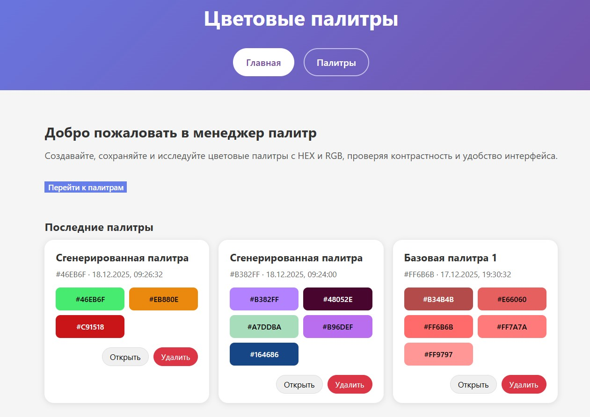
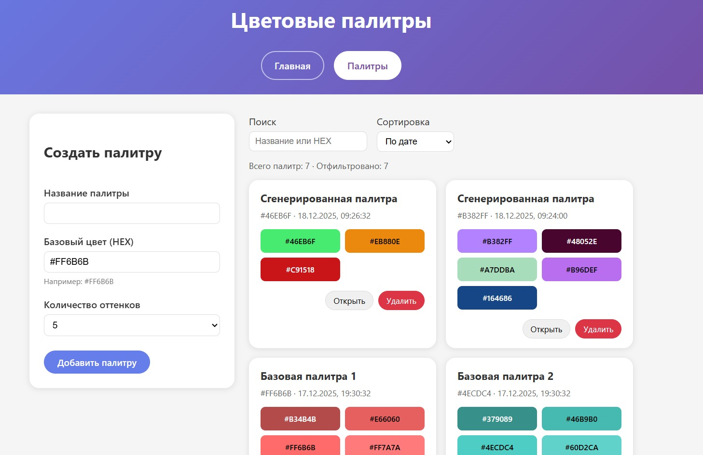
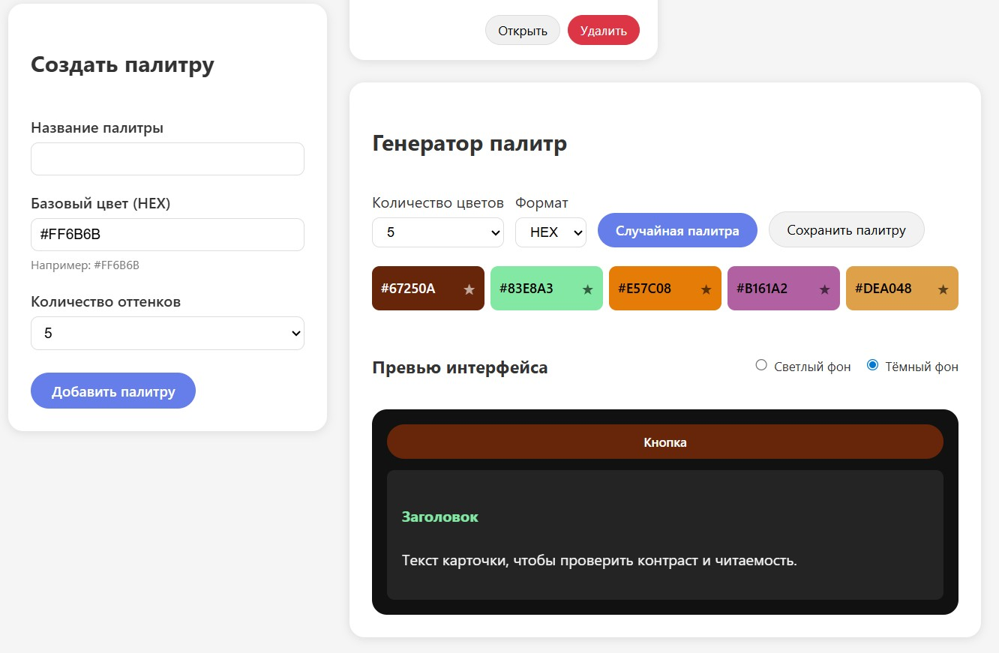
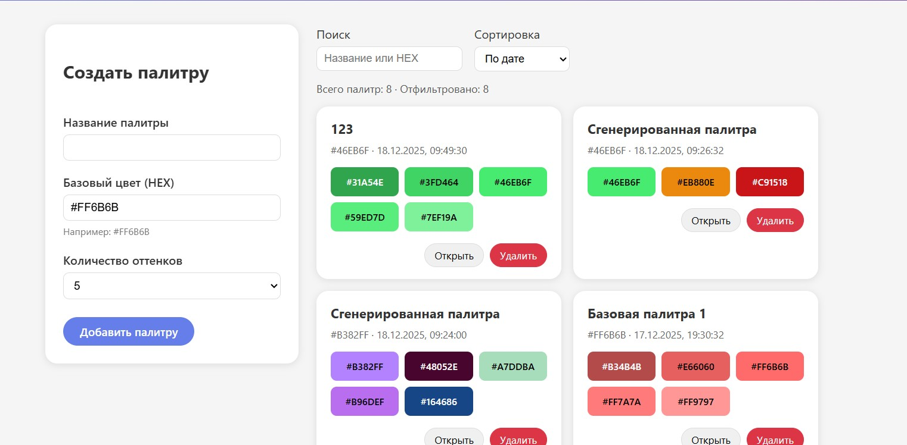

## Описание

Одностраничное приложение на Vue 3 для генерации и управления цветовыми палитрами.  
Поддерживает генерацию случайных палитр, сохранение в localStorage, просмотр в виде карточек и детальных страниц, а также проверку контраста в макете интерфейса.

## Установка и запуск

1. Клонировать репозиторий или скачать архив с проектом.
2. Установить зависимости:

npm install

3. Запустить приложение в режиме разработки:

npm run dev

По умолчанию приложение будет доступно по адресу, который выведет Vite (обычно `http://localhost:5173`).

## Использование

1. Открыть приложение в браузере.  
2. На главной странице можно увидеть последние сохранённые палитры и перейти на вкладку «Палитры» через верхнее меню.  
3. На странице «Палитры» можно:
   - Слева создать палитру, указав название, базовый HEX‑цвет и количество оттенков, затем нажать «Добавить палитру».  
   - Справа искать и сортировать палитры, открывать карточки и удалять ненужные.  
4. В блоке «Генератор палитр» можно:
   - Выбрать количество цветов и формат отображения (HEX или RGB).  
   - Нажать «Случайная палитра» для генерации набора цветов.  
   - Клик по цветовой карточке копирует значение; звёздочка позволяет закрепить цвет перед следующей генерацией.  
   - Нажать «Сохранить палитру», чтобы добавить текущий набор в общий список.  
   - В секции «Превью интерфейса» переключать светлый и тёмный фон и оценивать контраст кнопки и заголовка.  
5. На детальной странице палитры можно:
   - Просматривать оттенки с HEX и RGB.  
   - Кликать по цвету для копирования значения.  
   - Удалить палитру или вернуться к списку.

## Скриншоты

